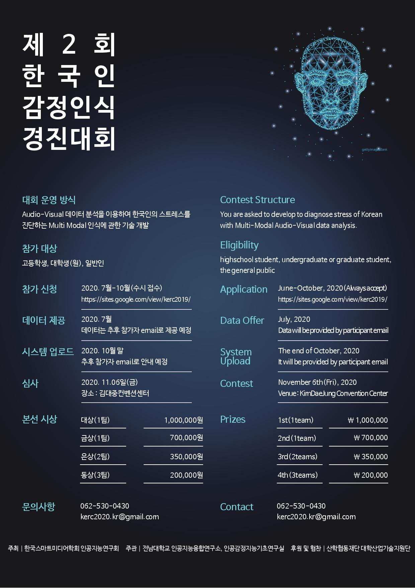

# Kaggle Competition 2020_kerc
## 2020 Korean Emotion Recognition Challenge
[\[Competition Page\]](https://www.kaggle.com/c/2020kerc/overview)

 

### Private Leaderboard Score : 0.96578 (Bronze Medal Award)
[\[Solution\]](./kerc2020_solution_HouKM_동상.pdf)

   

***Enviroment Setup:

-CUDA version  V9.0.176
-Cudnn version v7.1
-Anaconda Python 3.6.8
-Tensorflow 1.13.1
-Keras 2.2.4
-Library in the requirement.txt file (if needed)

*** Step to Step:

-Step 1: Extract the main face in each frame of the video clip. Save them to Data folder
-Step 2: data_rearrange.py: run file to create the "data_file.csv" to save the information of data.
-Step 3: extract_features.py: run file to extract the feature of the data by VGG16 pretrain on VGGFace dataset. (you can change the other pretrain model in the extractor.py file). Running this file will create sub folder "sequences" in folder "Data". You can get the features of baseline model in link: https://github.com/crazywolfxju/Features_1/tree/master/sequences
-Step 4: train.py: run file to training the baseline model (you can create new model in the models.py file)
-Step 5: test.py: run file to testing, it will calculate the mean squared error (MSE) metric
